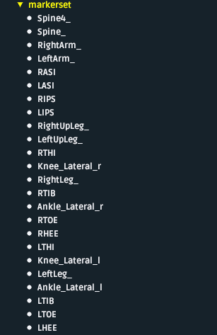

# Dari to OpenSim integration 
## 1. Introduction

#### Project Objective
The objective of this project is to validate the quality of skeletal model simulation in the OpenSim environment.

#### Simulation Data Source
The simulation will be based on motion capture data collected using the Dari Motion system.

#### Skeletal Model Development
The skeletal model for OpenSim is developed manually with step-by-step adjustments based on the results of experimental simulations. The model incorporates a set of virtual markers generated by the Dari Motion software.

#### Validation Method
The validation of the simulation results will be performed by comparing the joint angles obtained in the OpenSim simulation with those provided by the Dari Motion software.

#### Data Format
The simulation workflow utilizes motion capture data in C3D format, which is exported from the Dari Motion software. This data format contains time-series records of marker coordinates and the corresponding joint angles.

## 2. Prerequisites
* OpenSim 4.5, Python 3.9

## 3. Model

<p align="center">
<figure>
  
  <figcaption>Model with markeset</figcaption>
</figure>
</p>

3. Markerset

<p align="center">
<figure>
  
  <figcaption>Markeset</figcaption>
</figure>
</p>

## 3. How to work with the model

#### Data Conversion
Since the C3D format is used, it must be converted into a format compatible with the OpenSim environment.

This conversion can be performed using a dedicated script developed for this project. 

Function description:
```{python}
c3d_to_trc.py

def c3d_to_trc_custom(
    input_c3d_path, 
    output_trc_path, 
    new_rate=100.0,
    assume_z_up=True
):

```
Convert a C3D to TRC, optionally rotating from Z-up to Y-up,
and optionally resampling from old_rate to new_rate (Hz).

    Steps:
      1) Read the C3D with ezc3d.
      2) Extract marker data & labels.
      3) Rotate marker data if assume_z_up=True:
           X' = X
           Y' = Z
           Z' = -Y
         so that Y is up in the resulting TRC (OpenSim's convention).
      4) Resample if new_rate is specified (e.g., 100 Hz).
      5) Write the final marker data as TRC with correct header.
    
    Args:
      input_c3d_path (str): Path to the .c3d file
      output_trc_path (str): Path for the output .trc file
      new_rate (float or None): If given, resample to this rate (Hz).
                                If None, use the original rate from the C3D.
      assume_z_up (bool): Whether to apply the rotation from Z-up to Y-up.
                          If your data is already Y-up, set this False.
    
    Returns:
      None (writes out the TRC file).
      
      
#### Model Scaling and Inverse Kinematic calculation

To work with the skeletal model, a scaling procedure must be performed.

This procedure can be executed using a static pose. However, if necessary, it is also possible to use 0.5 seconds of recorded data prior to the start of the exercise. The model scaling can be performed [manually](https://opensimconfluence.atlassian.net/wiki/spaces/OpenSim/pages/53089123/Getting+Started+with+Scaling) or [automatically](https://opensimconfluence.atlassian.net/wiki/spaces/OpenSim/pages/53089368/Scripting+in+the+GUI) using the script provided with the project.
To execute the script, the following files are required:

1. A standalone skeletal model – without an embedded marker set.
2. A marker definition file – describing the marker set.
3. A scaling configuration file – containing the scaling parameters for the specific recording.

Inverse Kinematics Calculation
The inverse kinematics (IK) calculation can be performed manually.

Manual Mode Requirements
For manual execution, the following files are required:

1. A scaled model – obtained from the previous step.
2. A TRC file – converted from C3D using the ```c3d_to_trc.py ``` script.

Automatic Inverse Kinematics Calculation
For automatic inverse kinematics (IK) calculation, the Dari_Scaling script is used.

Required Files
To execute the script, the following files are required:

1. A scaled model – obtained from the previous step.
2. A TRC file – converted from C3D using the ```c3d_to_trc.py``` script.
3. A weight coefficients file – specifying the weighting factors for the marker set. ```Dari_squat_02_Setup_IK.xml```

```{python}
Dari_Scaling.py

import os.path

modelFolder = os.path.normpath("C:/Users/Maksim/Documents/GitHub/OpenSim_test")
  
# Define paths
scaleSetup		=	os.path.join(modelFolder, "Dari_scale_settings.xml");
markerSetFile   =	os.path.join(modelFolder, "Dari_Scale_Marker_Set_v0.1.xml");
ikSetupFile		=	os.path.join(modelFolder, "Dari_squat_02_Setup_IK.xml");

# Models
modelName	    =	os.path.join(modelFolder, "Rajagopal2015_passiveCal_hipAbdMoved_no_markers.osim");
scaleModelName	=	os.path.join(modelFolder, "subject01_simbody.osim");

# Output data files
ikMotionFilePath=	os.path.join(modelFolder,"subject01_walk1_ik.mot");
idResultsFile	=	os.path.join(modelFolder,"subject01_inverse_dynamics.sto");

# Define some of the subject measurements
subjectMass		=	72.6


## load and define model

# Load model 
loadModel(modelName)
# Get a handle to the current model
myModel = getCurrentModel()
#initialize
myModel.initSystem()
myState = myModel.initSystem()

## Scaling Tool

# Create the scale tool object from existing xml
scaleTool = modeling.ScaleTool(scaleSetup)
scaleTool.run()

## load Scaled Model

# Load model 
loadModel(scaleModelName)
# Create a copy of the scaled model for use with the tools.
myModel = getCurrentModel().clone()
#initialize
myModel.initSystem()
myState = myModel.initSystem

```

### Validation Process
For validation, a Jupyter Notebook ```Dari_to_OpenSim_Validation```  is used to perform a visual comparison of inverse kinematics (IK) results across multiple recordings.

### List of files
1. Dari_Rajagopal_2015_passiveCal_hipAbdMoved.osim
2. Rajagopal2015_passiveCal_hipAbdMoved_no_markers.osim
3. Dari_scale_settings.xml
4. Dari_Scale_Marker_Set_v0.1.xml
5. Dari_squat_02_Setup_IK.xml
6. Dari_Scaling.py
7. c3d_to_trc.py
8. Captury_Subj1_squat02.trc
 
